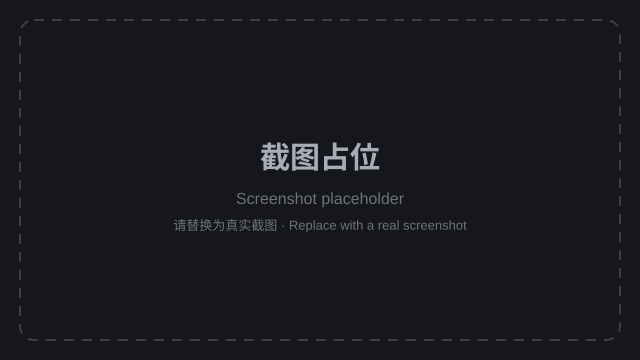

# Work-Rest Timer

> A floating Pomodoro-style reminder that runs in the DeepSeek Harness (DSH) browser client and speaks a Chinese voice reminder when it's time to rest or get back to work.

[](LICENSE)
[](https://github.com/kol-mm/work-rest-timer/actions/workflows/ci.yml)

**Language**：[中文](./README.md) · [English](./README.en.md)

## Screenshots



## Overview

It's easy to lose track of time when you're focused on work. This plugin is a **Pomodoro-style** work/rest cycle reminder:

- After N minutes of focused work, it reminds you to take a break;
- After M minutes of rest, it reminds you to get back to work;
- Work and rest alternate automatically (auto-loop can be disabled).

It lives as a small floating card pinned to the bottom-right corner, always showing the current phase and time remaining without interrupting your workflow.

## Features

- ⏱️ **Countdown**: large `MM:SS` countdown with a colored progress bar (work = green, rest = orange).
- 🔊 **Voice reminders**: speaks Chinese aloud when a phase ends, accompanied by a short chime.
- ⚙️ **Configurable durations**: work and rest lengths are both adjustable (1–600 minutes).
- 🔁 **Auto-loop**: automatically switches between work and rest (can be disabled).
- ▶️ **Controls**: start / pause, reset, skip.
- 📌 **Floating card**: pinned to the bottom-right; collapse it into a small pill.

## UI reference

| Area | Description |
| --- | --- |
| Header label | Current phase ("Working" green / "Resting" orange) |
| Countdown | Large `MM:SS`, refreshed every second |
| Progress bar | Elapsed / remaining ratio of the current phase |
| Controls | Start / pause, reset, skip |
| Settings (⚙) | Work duration, rest duration, voice reminder, auto-loop |
| Collapse (–) | Shrink into a bottom-right pill; click to expand again |

## Quick start

This plugin is a DSH **dynamic Cordis plugin (Client-only)**:

1. Open DSH and enter a session.
2. Copy the whole `return { ... }` block from `work-rest-timer.client.js`.
3. Pass it as `code.client` to `cordis_define`.
4. Run `cordis_run`; once approved, the card appears in the bottom-right corner.

> The plugin is a temporary, process-local extension: stopping / updating / removing it dismisses the card. The source is fully preserved in this repo and can be re-run at any time.

## Configuration

| Option | Default | Range | Description |
| --- | --- | --- | --- |
| Work duration | 25 min | 1–600 min | Length of the focus (work) phase |
| Rest duration | 5 min | 1–600 min | Length of the rest phase |
| Voice reminder | On | On / Off | Speak aloud + chime when a phase ends |
| Auto-loop | On | On / Off | Automatically switch to the next phase |

## How it works

- **Runtime**: DSH browser client; the plugin injects into the `shell.overlay` slot without replacing any existing UI.
- **Timing**: uses the DSH `timer` service (`ctx.interval`) to tick down once per second and switch phases at zero.
- **Voice**: uses the browser's native `speechSynthesis` with `lang = 'zh-CN'`.
- **Chime**: uses the Web Audio `AudioContext` for a short attention beep.
- **Lifecycle**: every side effect (styles, slot registration, timers) is scoped to the plugin fiber and cleaned up on stop.

## Requirements

- DeepSeek Harness (DSH) browser client.
- A browser supporting `speechSynthesis` (voice) and `AudioContext` (chime, optional).
- **Chinese voice pack** for Chinese speech (Windows: Settings → Time & language → Speech → Add voices).

## Project structure

```
work-rest-timer/
├── .github/
│   └── workflows/
│       └── ci.yml              # GitHub Actions CI
├── docs/
│   └── screenshots/
│       └── screenshot.svg      # UI screenshot (placeholder)
├── scripts/
│   └── validate.js             # syntax / structure validation script
├── README.md                   # Chinese README
├── README.en.md                # English README
├── LICENSE                     # MIT license
├── .gitignore
└── work-rest-timer.client.js   # plugin Client source
```

## FAQ

**Q: No sound when a phase ends?**
A: Make sure "Settings → Voice reminder" is on, and that the browser allows audio. Usually, once you've clicked "Start", the browser allows speech and chime playback.

**Q: The voice isn't Chinese / sounds off?**
A: The system falls back to a default voice when no Chinese voice pack is installed. Install a Chinese voice (e.g., Microsoft Huihui / Xiaoxiao).

**Q: Can it remind me only once instead of looping?**
A: Yes — turn off "Settings → Auto-loop"; the timer pauses at the end of a phase.

**Q: The card covers content?**
A: Click the "–" button to collapse it into a small bottom-right pill.

## License

[MIT](./LICENSE) © kol-mm
