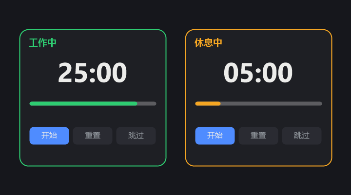

# 工作 / 休息计时器（Work-Rest Timer）

> 一个悬浮的番茄钟式提醒工具，运行在 DeepSeek Harness（DSH）的浏览器客户端里。到时间会用中文语音提醒你休息或开始工作。

[](LICENSE)
[](https://github.com/kol-mm/dsh-work-rest-timer/actions/workflows/ci.yml)

**语言 / Language**：[中文](./README.md) · [English](./README.en.md)

## 截图



## 简介

长时间盯着屏幕工作，很容易忘记休息。这个插件是一个**番茄钟（Pomodoro）式**的「工作 / 休息」循环提醒器：

- 专注工作 N 分钟后，语音提醒你「该休息一下啦」；
- 休息 M 分钟后，语音提醒你「开始工作吧」；
- 工作与休息循环交替（可关闭自动循环）。

它以一张**悬浮小卡片**的形式固定在页面右下角，随时显示当前阶段和剩余时间，不打断你的工作流。

## 功能特性

- ⏱️ **倒计时显示**：大号 `MM:SS` 倒计时 + 彩色进度条（工作 = 绿色，休息 = 橙色）。
- 🔊 **语音提醒**：到时间自动中文播报，并伴随短促提示音。
- 🎵 **试音**：设置里一键试听提醒语音，验证声音是否正常。
- ⚙️ **可配置时长**：工作时长、休息时长均可自定义（1–600 分钟）。
- 🔁 **自动循环**：工作 ↔ 休息自动切换（可关闭）。
- ▶️ **控制按钮**：开始 / 暂停、重置、跳过。
- 📌 **悬浮小卡片**：固定在右下角，可收起成一个小圆点，不打扰使用。

## 界面说明

| 区域 | 说明 |
| --- | --- |
| 顶部标签 | 显示当前阶段（「工作中」绿色 /「休息中」橙色） |
| 倒计时 | 大号 `MM:SS`，每秒刷新 |
| 进度条 | 显示当前阶段已用 / 剩余比例 |
| 控制按钮 | 开始 / 暂停、重置、跳过 |
| 设置（⚙） | 工作时长、休息时长、语音提醒（含试音）、自动循环 |
| 收起（–） | 收成右下角小圆点，点圆点重新展开 |

## 快速开始

本插件是 DSH 的**动态 Cordis 插件（仅 Client 端）**，运行方式：

1. 打开 DSH，进入会话；
2. 复制 `work-rest-timer.client.js` 中 `return { ... }` 的整块代码；
3. 将其作为 `code.client` 传入 `cordis_define`；
4. 执行 `cordis_run`，批准后插件即在浏览器里激活，右下角出现计时器卡片。

> 插件是进程内的临时扩展：停止 / 更新 / 删除插件后卡片会随之消失；代码本身已完整保存在本仓库，可随时重新运行。

## 配置项

| 配置项 | 默认值 | 可选范围 | 说明 |
| --- | --- | --- | --- |
| 工作时长 | 25 分钟 | 1–600 分钟 | 专注（工作）阶段时长 |
| 休息时长 | 5 分钟 | 1–600 分钟 | 休息阶段时长 |
| 语音提醒 | 开启 | 开 / 关 | 到时间是否语音播报 + 提示音 |
| 自动循环 | 开启 | 开 / 关 | 阶段结束后是否自动切换到下一阶段 |

## 工作原理

- **运行环境**：DSH 浏览器客户端，插件代码通过 `shell.overlay` 插槽注入悬浮层，不替换任何原有界面。
- **计时**：使用 DSH 提供的 `timer` 服务（`ctx.interval`）每秒递减一次，倒计时归零时切换阶段。
- **语音**：使用浏览器原生 `speechSynthesis`，语言设为 `zh-CN`，播报中文提示语。
- **提示音**：使用 Web Audio `AudioContext` 播放短促提示音，增强提醒效果。
- **生命周期**：所有副作用（样式、插槽注册、计时器）都随插件 Fiber 一起清理，停止插件即完全卸载。

## 环境要求

- DeepSeek Harness（DSH）浏览器客户端；
- 浏览器需支持 `speechSynthesis`（语音播报）与 `AudioContext`（提示音，可选）；
- **中文语音包**：若需中文播报，请在系统里安装中文语音（Windows：设置 → 时间和语言 → 语音 → 添加语音）。

## 文件结构

```
work-rest-timer/
├── .github/
│   └── workflows/
│       ├── ci.yml              # GitHub Actions 自动校验
│       └── release.yml         # 打 tag 自动发布 Release
├── docs/
│   └── screenshots/
│       └── screenshot.png      # 界面截图
├── scripts/
│   └── validate.js             # 插件源码语法/结构校验脚本
├── README.md                   # 中文说明
├── README.en.md                # English README
├── LICENSE                     # MIT 许可证
├── .gitignore
└── work-rest-timer.client.js   # 插件 Client 端源码
```

## 常见问题（FAQ）

**Q：到时间没声音？**
A：先确认「设置 → 语音提醒」已开启；再检查浏览器是否允许自动播放音频。通常点过一次「开始」按钮后，浏览器会放行语音与提示音。

**Q：语音不是中文 / 念得很奇怪？**
A：系统缺少中文语音包时会回退到默认语音。请在系统里安装中文语音（如 Microsoft Huihui / Xiaoxiao）。

**Q：可以只提醒一次、不自动循环吗？**
A：可以，把「设置 → 自动循环」关闭即可；阶段结束后会暂停并停在该阶段。

**Q：卡片挡到内容了？**
A：点右上角「–」可把卡片收成右下角的小圆点，随时点开。

## 许可证

[MIT](./LICENSE) © kol-mm
